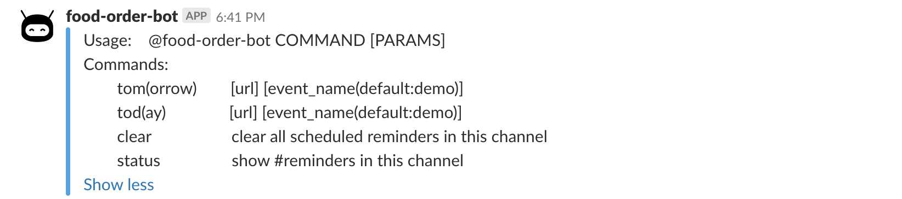
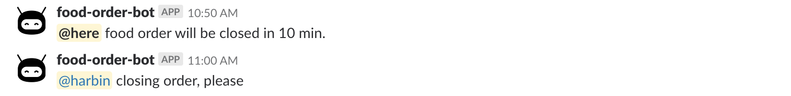

# food-order-bot
The food-order-bot is helping people order food. It's designed for two goals:
1. Remind people to order food and close food order.
2. Collect people food reviews and provide restaurant recommendation based on it.

# Usage
#### help  
Food-order-bot provides options for today or tomorrow food order.

#### start

#### remind

#### review

#### review result

#### full view

### High level
The slack-bot is a HTTP server handling three HTTP req:
1. "challenge": It is for slack bot verification.
2. "json": It is a trigger for bot scheduling event.
3. "payload": It is a button event for people reviews.

### TODO
1. Food recommendation.
2. database init: Start from the latest record id if database already exists. 
3. Remind time self-defined.

