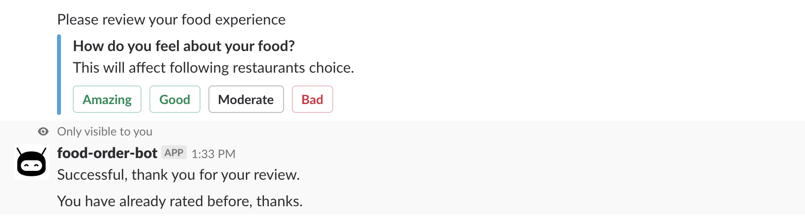
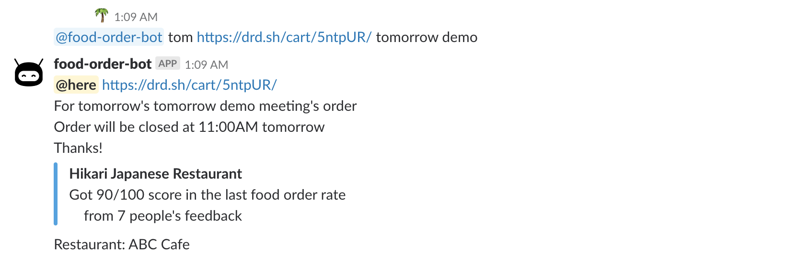

# food-order-bot
The food-order-bot is helping people order food. It's designed for two goals:
1. Remind people to order food and close food order.
2. Collect people food reviews and provide restaurant recommendation based on it.

# Usage
### help  
food-order-bot provides options for today or tomorrow food order.

### start

### remind
1. food-order-bot reminds people in channel 10 minutes(adjustable) before order close.
2. food-order-bot reminds people who start this order to close the order.

### review
1. Provides 4 options for people to review.
2. Only 1 review for each person.
3. Review feedback is sent by ephemeral message "Only visible to you".

### review result

### full view
1. Everyone can use food-order-bot to start order-reminder.
2. Only person who starts it will receive close-order reminder.

# Implementation
### High level
food-order-bot is using: 
1. python flask server to handle user request.
2. sqlite3 to store users' review and restaurants' overall review.
3. docker to build service.
### flask
The slack-bot is a HTTP server handling three HTTP req:
1. "challenge": It is for slack bot verification.
2. "json": It is a trigger for bot scheduling event.
3. "payload": It is a button event for people reviews.
### sqlite3
1. database structure.
    1. users' review
    2. restaurant review.
### docker
1. [Dockerfile](Dockerfile)

### TODO
1. Food recommendation.
2. database init: Start from the latest record id if database already exists. 
3. Remind time self-defined.
4. Deduplicate if multiple order message exist.
